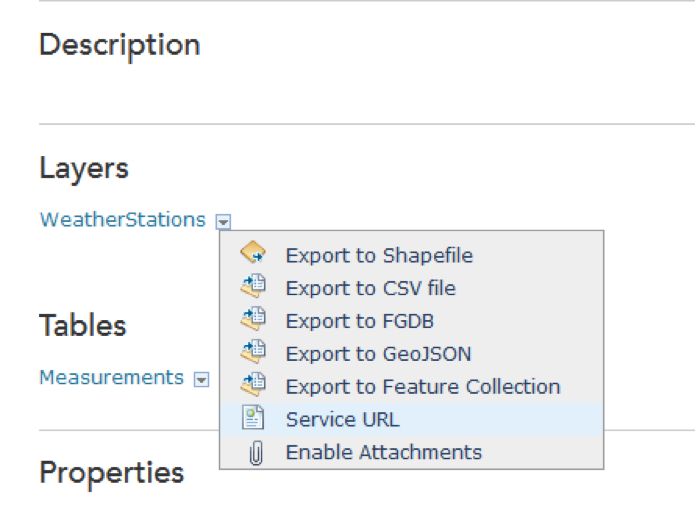
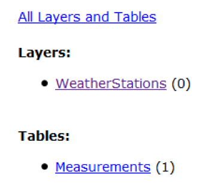
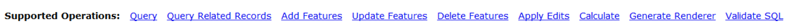
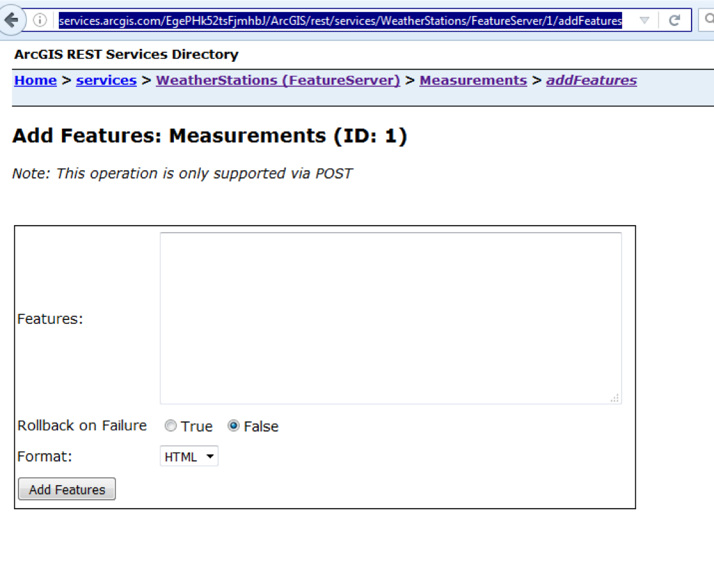
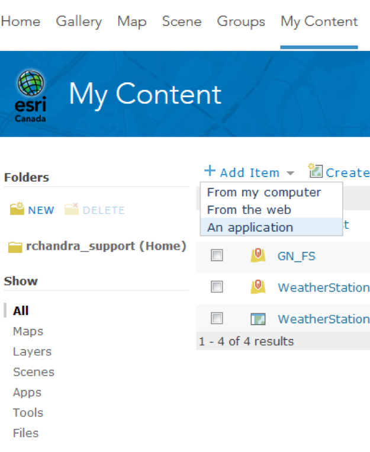
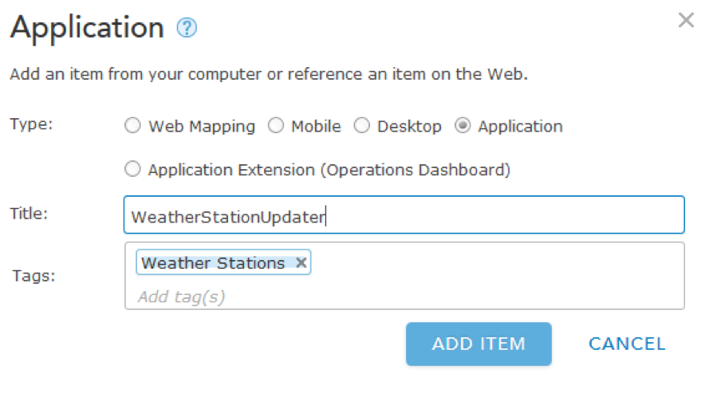
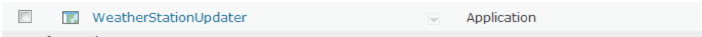
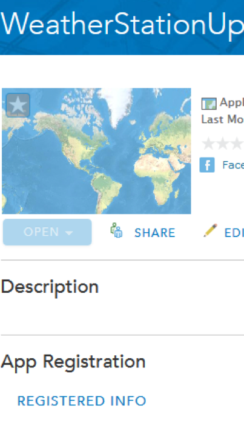

#Using python to upload data to ArcGIS Online

One of the advantages of using ArcGIS Online is that feature services hosted on the platform come with a REST (Representational State Transfer) endpoint that can be accessed via HTTP calls. This can be combined with a python site package like requests to streamline the process of taking data from a device, like a Raspberry Pi, and making it available through ArcGIS Online.

What you’ll need to complete this tutorial
<ul>
<li>A computer with an internet connection.  We used a Raspberry Pi running Raspian for this tutorial.</li>
<li>Sample data (this can be the data from your weather station) on the Raspberry Pi</li>
<li>A feature service published to your ArcGIS Online organizational account or ArcGIS for Developers account</li>
<li>Some knowledge of programming in python</li>
</ul>

##Obtaining the REST endpoint of the feature service

Navigate to http://www.arcgis.com and log into your ArcGIS Online account. Once you’ve logged in, click on My Content at the top to bring up your list of objects. Click on the feature service to bring up the Item Details for it:

In this example, the feature service was published based on a file geodatabase containing a feature class related to a table. The feature class contains a point for each weather station, and the table contains all of the readings from the weather stations. A common StationID field was added to both and used with the relationship class, and that structure was preserved when the file geodatabase was uploaded into ArcGIS Online. You don’t have to use this exact structure for your eventual data upload, but the steps for getting to the REST endpoint of the feature service will be the same nonetheless.
Once you’ve gotten to the Item Details page as shown above, click on the little dropdown arrow on one of the layers and select Service URL:

This will take you to the level of the endpoint corresponding to the layer you just clicked on (looks something like http://services.arcgis.com/EgePHk52tsFjmhbJ/arcgis/rest/services/WeatherStations/FeatureServer/0), and you can navigate back to the root (http://services.arcgis.com/EgePHk52tsFjmhbJ/ArcGIS/rest/services/WeatherStations/FeatureServer in the same example) to get the URL for the root level of the hosted feature service. This will also show you the layers and tables that are contained within this specific service:

The next step is identifying the layers and/or tables that you need to update as part of your script. In our case, the WeatherStations layer only contains a single point for each weather station, which can even be determined manually, so we’re more interested in sending updates to the Measurements tables. You can get its REST endpoint by clicking on the link (http://services.arcgis.com/EgePHk52tsFjmhbJ/ArcGIS/rest/services/WeatherStations/FeatureServer/1 in the same example as above). Scroll to the bottom of the page and you’ll see the supported operations for this particular layer:

For our purposes, the main one we’re interested in is Add Features, since our script is going to be taking data from our Raspberry Pi and uploading that data to this layer. If you click on the link for Add Features, you’ll get both the Add Features screen, as well as the URL that you’ll use in your python script to do the updates (http://services.arcgis.com/EgePHk52tsFjmhbJ/ArcGIS/rest/services/WeatherStations/FeatureServer/1/addFeatures in our example):

We can come back to this URL in order to manually test adding features to this particular layer, but for now make note of the above URL for your layer, as we’ll need to use that in our script in order to upload the data.

##Installing Requests on the Raspberry Pi

This step is optional. Python includes a built-in library that you can use to make HTTP requests, which is called urllib2. While it’s possible to add features to our ArcGIS Online feature service using urllib2, installing the Requests library on your Raspberry Pi will allow you to accomplish the same thing using a much simpler and cleaner set of code, a sample of which has already been posted by Esri on the ArcGIS for Developers website.

You can read more about the Requests library at this link: http://www.python-requests.org/en/latest/. You can install Requests by issuing the “pip install requests” command on the Raspberry Pi, or by following the more detailed set of instructions on the website that don’t include using pip.

##Registering your application with ArcGIS Online

Before you can make use of the Requests module in your python script, you’ll need to register your application with your ArcGIS Online account. The reason this is required is for authentication purposes. ArcGIS Online uses OAUTH 2.0 (http://oauth.net/2/) and requires the generation of an access token which is then used with remote operations made against the feature service, such as the addition of new rows.

Generating a token requires and Application ID and an Application Secret, both of which are provided to you when you register your application with your ArcGIS Online account. To do that, browse to your My Content section in ArcGIS Online, click the dropdown arrow next to Add Item and choose to add an application:

This brings up the Add Application window, which has several operations for the type of application that can be added to ArcGIS Online. For our purposes, we’re only interested in registering an application to be able to obtain an Application ID and Application Secret for use with our python script, so we can pick the generic Application Type and fill in any other relevant details:

Once you’ve done that, you can click on Add Item and you should see your new application available under My Content in ArcGIS Online:

If you navigate to the Item Details for your application, the information you need (both ID and secret) will be under the App Registration section:

Click on the REGISTERED INFO link to bring up the App ID, and then click on the Show Secret link that comes up to bring up the App Secret. Note down both of these values, as we’re going to use them when creating our python script.

##Creating the python script to upload data to ArcGIS Online

The actual form your final python script will take may vary depending on your source data and the structure of your feature service, but regardless of those details, all of the scripts created in this section will have two things in common. They will both generate an access token, and they will both use the addFeatures URL we retrieved earlier to add rows into the feature service, once the access token has been obtained. Luckily, there are samples for both of these processes available on the ArcGIS for Developers website: https://developers.arcgis.com/authentication/accessing-arcgis-online-services/#getting-a-token.

Before you can start uploading your data to ArcGIS Online, you’ll need to generate an access token. Based on the link above, your code for generating the token might look something like this:

<pre>
params = {'client_id': "xxxxxxxxxxxx", 'client_secret': "xxxxxxxxxxxxxxxxxxxx", 'grant_type': "client_credentials"}
request = requests.get('https://www.arcgis.com/sharing/oauth2/token', params=params)
response = request.json()
token = response["access_token"]
</pre>

This is all of the code that is required to generate the access token. It goes through the following steps:
<ol>
<li>Creates a variable called params and assigns to it a JSON object containing the App ID and App Secret retrieved from ArcGIS Online</li>
<li>Creates a variable called request and assigns to it an HTTP GET request for authentication to ArcGIS Online, based on the parameters specified in the previous line</li>
<li>Creates a variable called response and assigns to it the JSON response to the HTTP GET request</li>
<li>Creates a final variable called token, which contains the actual access token that was returned by ArcGIS Online</li>
</ol>

Once we have our access token, we can feed into our actual addFeatures operation. You can review the link above to see what that might look like, but a corresponding section of the above script might look like this:

<pre>
add_url = "http://services.arcgis.com/EgePHk52tsFjmhbJ/arcgis/rest/services/WeatherStations/FeatureServer/1/addFeatures"
add_features_params = {'f': 'json', 'token': token, 'features': feature_json}
data = requests.post(add_url, params=add_features_params)
print data.json()
</pre>

This code is doing the following:
<ol>
<li>Creating a variable called add_url, and setting it equal to the addFeatures URL that we retrieved earlier from our feature service</li>
<li>Creating a variable called add_features_params and setting it equal to a JSON string. The JSON object specifies the parameters we’ll be attaching to the addFeatures request, which include a JSON format for the response, the access token we generated earlier in the script, and the actual JSON representing the features we want to add (you can see an example of what this looks like here: http://resources.arcgis.com/en/help/rest/apiref/fsadd.html)</li>
<li>Creating a variable called data and setting it equal to the actual HTTP POST request that we make. The request contains our URL and the parameters we want to use with the addFeatures request</li>
<li>Printing the JSON response to the request we just made</li>
</ol>

Between the two code sections listed above, you can add logic to your script to read data from your device and upload it to ArcGIS Online using he addFeatures request.
